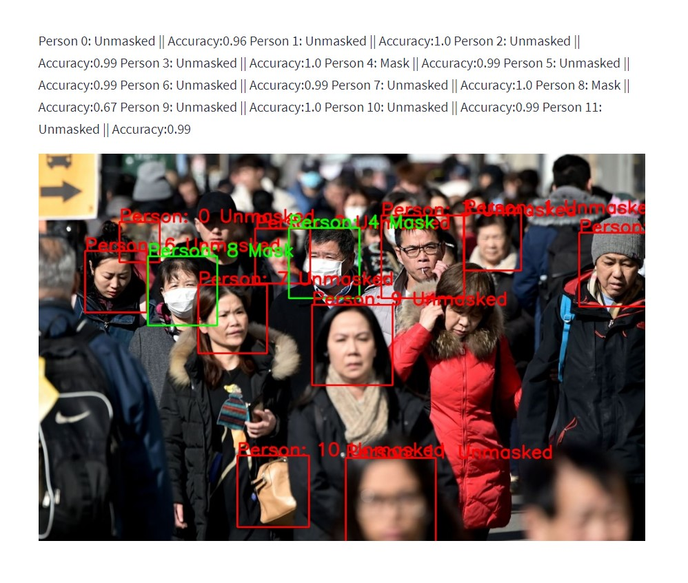

# Mask Detector for Crowds

Deployed at: https://maskedornot.herokuapp.com/

### About
DNN used for detecting face masks in crowds. Upload any image of people (either alone or in a group) to detect and count the face mask wearers.

### Example output

